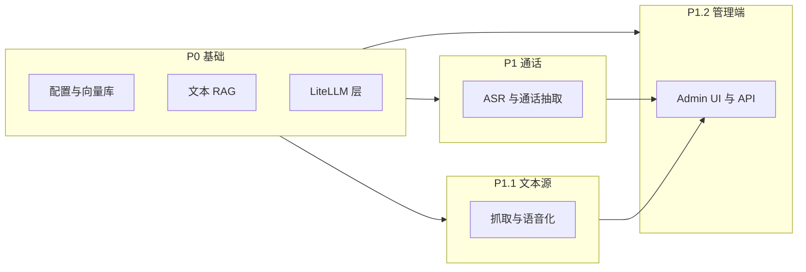

# Voice RAG — 实施计划（由 SPEC 派生）

**对应规格：** [`../SPEC.md`](../SPEC.md) **v0.6**  
**文档角色：** 将 SPEC 中的功能/非功能需求映射为**可执行的开发阶段、工作包与验收要点**；与叙事型 [`PLAN.zh.md`](PLAN.zh.md) 互补（后者偏产品故事与目录，本文偏落地顺序）。

**维护约定：** SPEC 升级（如 v0.5.1 → v0.6）时，须同步更新本文件的版本号、阶段验收与任务清单。

---

## 1. 目标对齐（摘自 SPEC §1、§0）

| SPEC 要点 | 实施含义 |
|-----------|----------|
| 三路入库：通话原声、本地文档、网址/图文（§4.1–4.3） | 三条 ingest 管线 + 统一向量索引 |
| 语音就绪 + **FR-T7** 图文指代（§4.2） | `prompts/voice_transform*` + OCR（P2） |
| **FR-R7** + §6.2 `disabled` | 默认检索排除软禁用单元；可选 `include_disabled` |
| LiteLLM 统一 LLM（§4.6） | 单一网关层 |
| 管理前端 `/admin`（§4.9、§17）+ **§12.0、§12.2** | REST 行为一致：同步/异步、分页、Bearer、导出上限 |
| **§10.1 MUST** | 引用、租户、禁用过滤、FR-T7 的自动化检查 |
| **NFR-11** | README 声明抓取/版权责任在部署方 |

---

## 2. 工作流总览

---

## 3. 分阶段路线图（对齐 SPEC §9）

| 阶段 | SPEC | 交付物摘要 | 建议验收 |
|------|------|------------|----------|
| **P0** | §9 | `VoiceRAGConfig`、向量存储、`query`+`Citation`、LiteLLM、默认**排除** `disabled`（§6.2 / FR-R7）、Docker 可启动 | §10.1：引用含 `unit_id`；租户单测（若实现 strict）；**disabled 单元不出现在默认 query** |
| **P1** | §9、§11.1 | ASR、分段、通话抽取、`ingest_call`、`CallIngestResult`、CLI；`POST /ingest/call` 默认 **200** 同步（§12.0） | `trace_id`；长音频若异步则 **202** + `job_id`，且 **`GET /api/v1/jobs/{job_id}`** 可用 |
| **P1.1** | §9、§11.2 | `ingest_text_kb`、正文提取、`voice_faq`/`voice_steps`、FR-T7、白名单 | 「指代+图」样本：通过或 `warnings`+降级；**不得**纯指代入库为 `voice_*`（§10.1） |
| **P1.2** | §9、§17 | `/admin`、FR-U1–U4、§12.2；`VOICERAG_ADMIN_TOKEN`（§12.0） | E2E：导入→列表→导出；**401** 当 token 已配但未带 Bearer；分页 `page_size`≤100 |
| **P2** | §9 | diarization、RRF、OCR、完整编辑/重嵌、异步任务 | §16 待决关闭或文档化 |
| **P3** | §9 | 音频嵌入、PDF、重排 | 可选 |

---

## 4. 工作包分解（任务清单）

### 4.1 基础设施

- [ ] 仓库骨架：`pyproject.toml`、`src/voice_rag/`、`LICENSE`、根 `README`（含 **NFR-11** 法律免责段落）
- [ ] `VoiceRAGConfig.from_env` 与 §8 对齐（含 `VOICERAG_ADMIN_TOKEN`、`VOICERAG_CHUNK_SIZE` 单位说明指向 README）
- [ ] 结构化日志 + `trace_id`（NFR-3）
- [ ] `VOICERAG_DATA_DIR` 与 §14
- [ ] `ruff` + `pytest` + CI（NFR-7）
- [ ] **§10.1 单测套件**：伪造 `citations` 测试拒绝；strict tenant；**disabled 单元**默认检索不可见；可选 FR-T7 禁止词 fixture

### 4.2 P0：文本 RAG + LLM

- [ ] `VectorStore` + LanceDB/Chroma
- [ ] 嵌入：`local` / `litellm`
- [ ] `build_index_from_documents`；`document_chunk`
- [ ] `query`：**过滤 `metadata.disabled`**（FR-R7）；`Citation` 含 `unit_id`
- [ ] LiteLLM 封装
- [ ] FastAPI：`/health`、`/query`；**CORS** 说明（§12.0）

### 4.3 P1：通话

- [ ] faster-whisper；`prompts/extract_call_*`
- [ ] `ingest_call`、幂等（NFR-2）
- [ ] `POST /ingest/call`：**200/202 语义不混用**（§12.0）
- [ ] `GET /api/v1/jobs/{job_id}`（若实现异步）
- [ ] CLI：`ingest-call`、`ask`

### 4.4 P1.1：文本源

- [ ] 抓取 + 白名单 + 超时
- [ ] `ingest_text_kb`、`POST /ingest/text-kb`
- [ ] `prompts/voice_transform_*` + FR-T7
- [ ] CLI：`ingest-url` / `ingest-text-kb`
- [ ] 单元 `metadata.warnings` 写入路径

### 4.5 P1.2：管理端 MVP

- [ ] §12.2：`GET /admin/units`（**分页默认与上限** §12.0）、`PATCH`（`disabled`、`text`…）、`POST /admin/export`（流或限时 URL，**413** `VOICERAG_EXPORT_TOO_LARGE`）
- [ ] Bearer 中间件：**401** `VOICERAG_UNAUTHORIZED`（§13）
- [ ] 前端路由 §17.1
- [ ] 错误码映射：**§13 全表**（含 `UNIT_NOT_FOUND`、`EXPORT_TOO_LARGE`）

### 4.6 P2

- [ ] diarization、RRF、OCR
- [ ] `/admin/reindex`、软删/重嵌
- [ ] `include_disabled` 查询参数（若实现）

### 4.7 P3

- [ ] 音频嵌入、PDF、重排

---

## 5. 与 SPEC §12.0 的契约检查表（发布前）

- [ ] `ingest` 同步返回 **200** 与异步 **202** 的**响应体形状**不混用
- [ ] `VOICERAG_ADMIN_TOKEN`：**未设**不校验；**已设**须 Bearer，否则 401
- [ ] `GET /admin/units`：`page`、`page_size` 默认与上限（§12.0）
- [ ] `POST /admin/export`：体积上限与 NFR-8 对齐
- [ ] 异步任务统一 **`GET /api/v1/jobs/{job_id}`**

---

## 6. 文档与交付物

| 产物 | 说明 |
|------|------|
| `README.md` | Quickstart、chunk 单位、同步/异步 ingest、CORS、**第三方站点抓取责任（NFR-11）** |
| `.env.example` | 对齐 §8 |
| `CONTRIBUTING.md` | PR 与本地运行 |
| `SECURITY.md` | 披露 |
| `prompts/` | 版本化 |

---

## 7. 风险与依赖（SPEC §16 + NFR-11）

- 嵌入模型、`chunk_size` 单位、异步 ingest 默认：**README 固定**。
- **内容与法律**：抓取频率、ToS、版权由部署方负责（NFR-11）。
- 生产：**管理面**须 token 或网关（NFR-9）。

---

## 8. 与 `PLAN.zh.md` 的关系

| 文件 | 侧重 |
|------|------|
| [`PLAN.zh.md`](PLAN.zh.md) | B2B 叙事、架构、目录、GitHub topics |
| **本文件** | SPEC v0.6 → **阶段 / 任务 / §10.1 / §12.0 契约** |

---

*实施计划结束 — 对应 SPEC v0.6*
