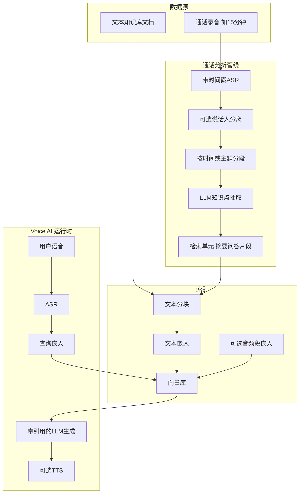

# Voice RAG 开源项目计划（中文版）

> 与 [`../SPEC.md`](../SPEC.md)（规格 **v0.6**）及 **[实施计划 `IMPLEMENTATION_PLAN.zh.md`](IMPLEMENTATION_PLAN.zh.md)**（SPEC→阶段/任务/§10.1/§12.0 契约）、Cursor `.cursor/plans/voice_rag_oss_860923bf.plan.md` **同步维护**。  
> **审阅顺序建议：** `SPEC.md`（含 §0 导航）→ `IMPLEMENTATION_PLAN.zh.md`（落地排期）→ 本文件（叙事与目录）。

---

## 1. 目标与定位

- **项目名称**：Voice RAG（仓库名建议 `voice-rag`，Python 包名 `voice_rag`）。

- **要解决的产品缺口**：在语音客服、AI 外呼/呼入等场景中，**文本知识库 + 文本 RAG** 往往已经具备，但**通话语音**需要额外大量处理：长录音、口语、打断、坐席/客户角色、信息散落在时间轴上——业界缺少从录音到可服务 **Voice AI** 的「**一步到位**」分析与索引方案。

- **核心用户故事**：输入一通约 **15 分钟**的客服录音 → 系统自动 **转写**并**结构化提炼知识点**（而非仅粗暴切块）→ 生成 **面向 Voice AI 的 RAG 索引** → 后续 AI 客服可通过检索「理解」该通话中的事实、承诺、处理结论与客户诉求，并与现有文本知识库 **统一检索**。

- **保留的通用能力**：普通文档入库；**网址、图文、帮助中心等文本源**经 **语音就绪改写**（短知识、可电话逐步指引）入库；可选 **音频嵌入** 与文本联合检索；演示层 **ASR + 对话（+ 可选 TTS）**。

- **开发者体验**：尽量 **自动/半自动**选用常见大模型 API；提供 **复制即用、步骤极少** 的 demo（Docker / 单命令）。

### 1.1 B2B 定位与「行业空白」叙事

- **买方画像**：面向 **B2B 企业**——呼叫中心、客户成功、销售陪练、内部 IT/HR 热线、B2B SaaS 支持等；已有工单、CRM、静态文档与文本 RAG，但大量知识**只存在于语音**（会议、录音、实时通话），未系统进入可检索知识层。

- **空白点**：文本知识库 + 传统 RAG 已是成熟品类；**从语音批量、自动化构建企业自有知识库并对接 Voice AI / 坐席辅助**，仍缺少 **开源、可私有化、可组合** 的端到端参考实现。

- **本项目主张**：Voice RAG 是 **「语音 → 结构化检索单元 → 与企业文档库统一索引」** 的自动化管线，降低将 **语音资产** 转为 **可运营知识资产** 的成本；文档中明确与 **闭源 CCaaS、仅 ASR SaaS** 的差异——我们补齐 **知识化 + RAG 就绪**，**不替代**电话系统。

- **落地预期**：生产环境仍建议 **人工抽检与治理**（质量、敏感信息、合规）；开源侧重 **可插拔模型**与**可审计引用**（时间戳、来源），便于接入企业现有审批与数据域策略。

---

## 2. 大模型 API：统一接入与较自动的选择

**目标**：用户主要通过 **环境变量**（或 `.env`）配置，**少改代码**即可在 **OpenAI、Anthropic、Google（Gemini）、Azure OpenAI、本地 OpenAI 兼容（Ollama/vLLM）** 等之间切换；嵌入与生成共用同一套「厂商 + Key」心智模型。

**推荐实现**：在核心库中用 **LiteLLM**（或等价薄封装）作为**唯一**调用入口：

- **模型字符串**：如 `VOICERAG_LLM_MODEL=gpt-4o-mini`、`claude-3-5-sonnet-20241022`、`gemini/gemini-1.5-flash` 等，由 LiteLLM 路由。
- **Key 解析**：读取 `OPENAI_API_KEY`、`ANTHROPIC_API_KEY`、`GEMINI_API_KEY`、`AZURE_*` 等；文档用 **表格**说明「用某厂商需设哪些变量」。
- **默认策略**：未显式指定模型时，可按 **优先级** 根据已存在的 Key 自动选默认小模型；启动时 **日志打印**当前 provider/model；可用 `VOICERAG_LLM_MODEL` 覆盖。
- **嵌入**：文本嵌入可走 LiteLLM 的 embedding，或与本地 `sentence-transformers` 二选一（`VOICERAG_EMBED_MODE=local|litellm`）。

**通话知识点抽取**、**RAG 生成** 均走该统一层，避免多套 HTTP 客户端散落各处。

---

## 3. 典型场景（叙事）

| 环节 | 说明 |
|------|------|
| 输入 | **①** 通话/会议等长音频；**②** URL/图文/导出包等**传统文本知识**；可选 **租户/业务线/工单/CRM ID** |
| 处理 | **音频**：转写 → 分段 →（可选）说话人分离 → **知识点抽取**。**文本源**：抓取/解析 → **语音就绪改写**（短知识、分步指引） |
| 输出 | 多类「检索单元」写入向量索引 + 引用回音频时间戳/说话人 |
| 运行时 | 用户侧语音 → ASR → 与文本库及历史通话提炼知识 **联合检索** → 生成回复（+TTS） |

**知识点**建议支持的抽取形态（可配置、分阶段落地）：

- **摘要**：整通或按话题段的短摘要（便于概览检索）。
- **主题/段落**：将长通话切为若干 topic span，每段可检索摘要 + 原文锚点。
- **问答式条目**：归纳「客户问 / 坐席答 / 结论」，贴近 FAQ 检索习惯。
- **实体与关键事实**：订单号、金额、承诺时间等（首版可用 LLM + 简单 schema）。

区别于「只存转写文本块」的朴素 RAG：索引层同时支持**回忆整通电话**与**精确事实查找**。

**帮助中心典型页**：「如遇**下方**报错」+ **截图/UI**——语音侧须**改写指代、合并 OCR 与步骤**（详见 `SPEC.md` §4.2 FR-T7、§17），不能念「请看下图」。

---

## 4. 建议架构（数据流）

- **默认路径**：通话 → 带时间戳转写 → 分段与知识点抽取 → **仅文本向量**（多粒度多条目共享同一时间轴）——易维护、易复现。  
- **进阶路径**：关键音频段 **音频嵌入**，与文本条目通过 `call_id` / `span_id` 关联；查询时对文本与音频结果做 **RRF 或加权融合**。

---

## 5. 仓库与目录结构（建议）

在工作区（如 `taotech/`）下新建 **`voice-rag/`**：

| 路径 | 作用 |
|------|------|
| `voice-rag/pyproject.toml` | 依赖与打包 |
| `voice-rag/src/voice_rag/` | 核心包：`pipelines/call.py`、`ingest`、`chunk`、`extract`、`embed`、`stores`、`retrieval`、`fusion`、`generation`、`config` |
| `voice-rag/examples/` | 单通录音入库、与文本目录合并建库示例 |
| `voice-rag/demo/` | FastAPI + 静态前端：**问答** + **`/admin` 语音知识管理**（导入/列表/详情/导出，见 SPEC §4.9、§17）；`docker-compose` 一键启动 |
| `voice-rag/docker-compose.yml` | 本地 demo：挂载 `.env`、端口、向量数据卷 |
| `voice-rag/tests/` | 单元测试（mock LLM/ASR） |
| `voice-rag/SPEC.md` | 产品与工程技术规格（中文） |
| `voice-rag/docs/PLAN.zh.md` | 本计划（中文） |
| `voice-rag/README.md` | 项目说明（建议英主中辅） |
| `voice-rag/LICENSE` | 如 MIT |
| `.github/workflows/ci.yml` | CI |

---

## 6. 技术选型

- **语言**：Python 3.11+  
- **向量库**：LanceDB 或 Chroma；抽象 `VectorStore`  
- **文本嵌入**：默认 `sentence-transformers`；可选 API  
- **ASR**：faster-whisper（本地，段/词时间戳）；可选云端适配器  
- **说话人分离**：可选 pyannote 等（许可单独说明）；首版可关，仅用固定窗口或语义分段  
- **LLM**：统一 LiteLLM；本地 vLLM/Ollama 用 OpenAI 兼容 `base_url`；提示词放 `prompts/`  
- **音频嵌入（可选）**：先接口 + 占位实现  
- **演示 TTS**：浏览器 Web Speech API 或后端轻量方案  

---

## 7. 核心库 API 形态

- **配置**：`VoiceRAGConfig`（分块、嵌入、是否 diarization、抽取与融合策略等）。  
- **文本索引**：`build_index_from_documents(...)`。  
- **通话索引**：`ingest_call(audio: Path, metadata: dict) -> CallIngestResult`。  
- **查询**：`query(text, audio) -> Answer`；`citations` 含 source、call_id、时间范围、说话人（若有）。  

---

## 8. Demo 与管理前端：尽量「复制即跑」

- 提供 **`docker-compose.yml`**；文档首屏：`cp .env.example .env` → 填写至少一个 LLM Key → `docker compose up`；可选 `make demo`。  
- 镜像内预装依赖；向量库**持久化**（命名卷或 bind mount）。  
- **问答区**：上传长录音、转写时间轴、知识点列表、模拟客服问答；`/health` 或页脚显示当前 **LLM provider/model**。  
- **管理区（`/admin`）**：知识**导入**（原声 / 网址与图文）、**列表与详情**、**编辑**（纠错/禁用）、**导出**（JSONL/CSV 等），详见 `SPEC.md` §4.9、§17。  
- 可选 **`VOICERAG_ADMIN_TOKEN`** 保护管理接口与 API。  
- 仅本地 Ollama + 本地嵌入时，README 说明能力边界。  
- **`.env.example`** 与 README 中的 **Key 对照表** 保持一致。  

---

## 9. 文档与开源治理

- **README**：一句话价值、架构图、Quickstart、与闭源 CCaaS/纯 ASR 的差异、隐私与数据驻留（部署方负责）。  
- **CONTRIBUTING**、**SECURITY**：贡献与安全披露流程。  

---

## 10. 实施顺序（建议）

1. **骨架**：目录结构、`pyproject.toml`、配置与日志。  
2. **LLM 统一层**：LiteLLM、环境变量约定、默认 provider 探测与日志。  
3. **文本 RAG**：分块、嵌入、向量库、检索、带引用生成。  
4. **通话管线 MVP**：ASR → 分段 → LLM 抽取摘要与若干 Q&A/要点 → 同一向量库多 `unit_type`。  
5. **可选**：diarization、音频嵌入、融合增强。  
6. **CLI**：如 `voice-rag ingest-call`、`voice-rag index-docs`。  
7. **demo**：compose + `.env.example` + 上传与问答。  
8. **CI + 文档润色**。  

---

## 11. 风险与简化策略

- **长音频成本**：提供抽样分段、`max_duration`、仅摘要模式等降级。  
- **质量**：口语噪声大；文档声明生产侧需**抽检**，不承诺全自动完美。  
- **合规**：录音与 PII 由使用者负责；不硬编码地域。  
- **第三方许可**：Whisper、pyannote 等在 README 列出。  

---

## 12. GitHub 上架（非代码）

- 仓库名如 `voice-rag`；topics 示例：`rag`, `speech`, `knowledge-base`, `enterprise`, `b2b`, `customer-service`, `call-center`, `whisper`, `voice-ai`, `python`。

---

## 13. 文档同步说明

- **Git 内**：本文件（计划）与根目录 [`../SPEC.md`](../SPEC.md)（规格）为中文主副本。  
- **Cursor**：`.cursor/plans/voice_rag_oss_860923bf.plan.md` 应与上述文件内容一致；任一方变更时请合并更新另两方。
